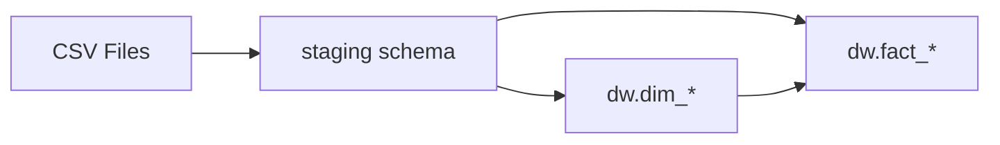
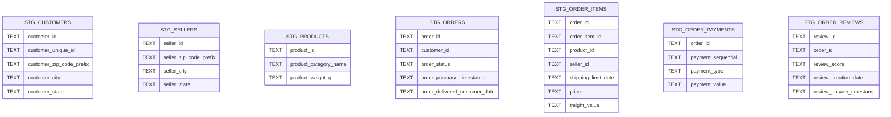
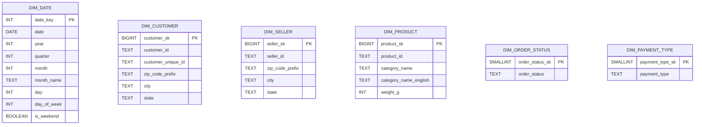
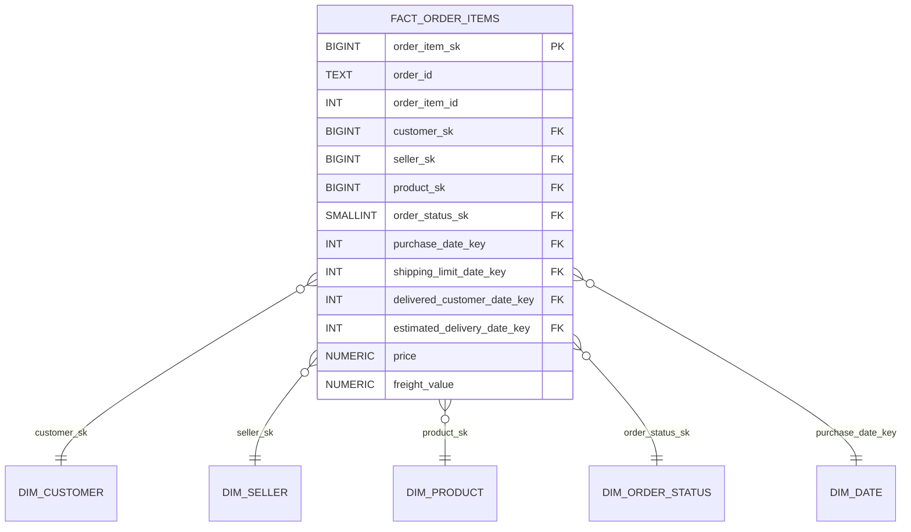
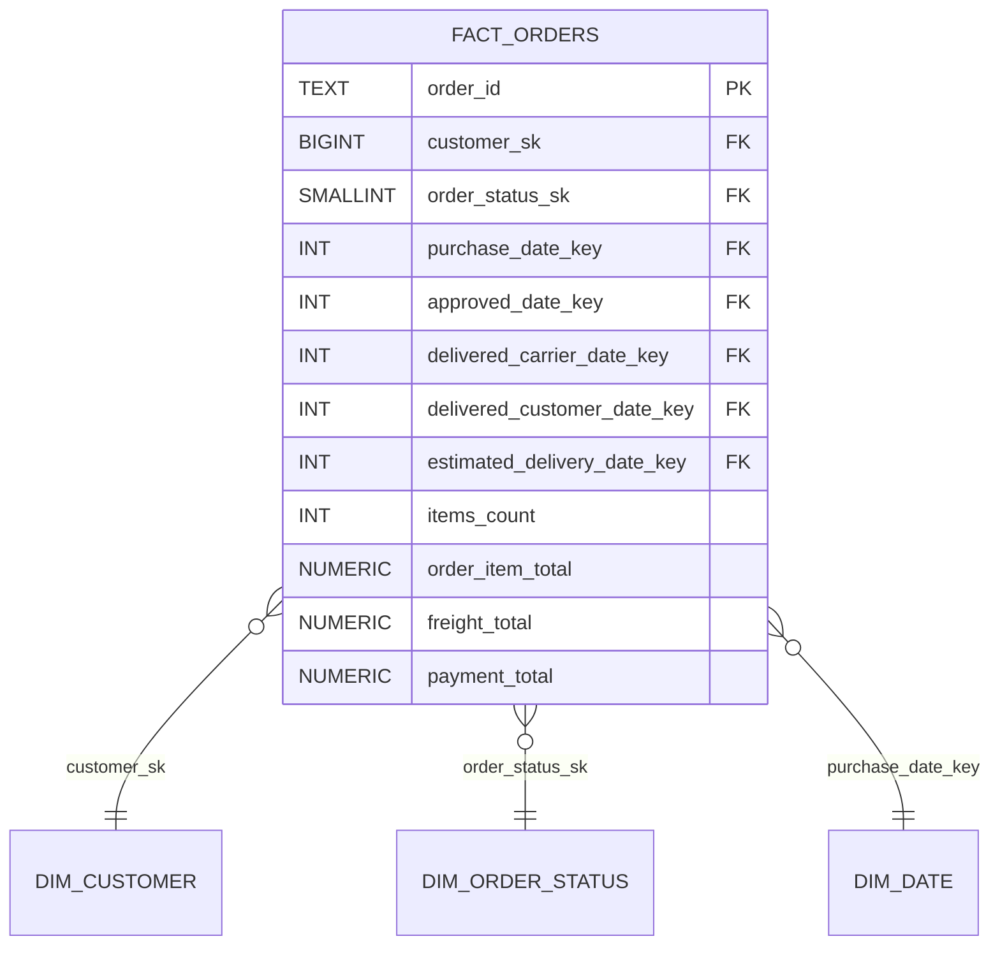
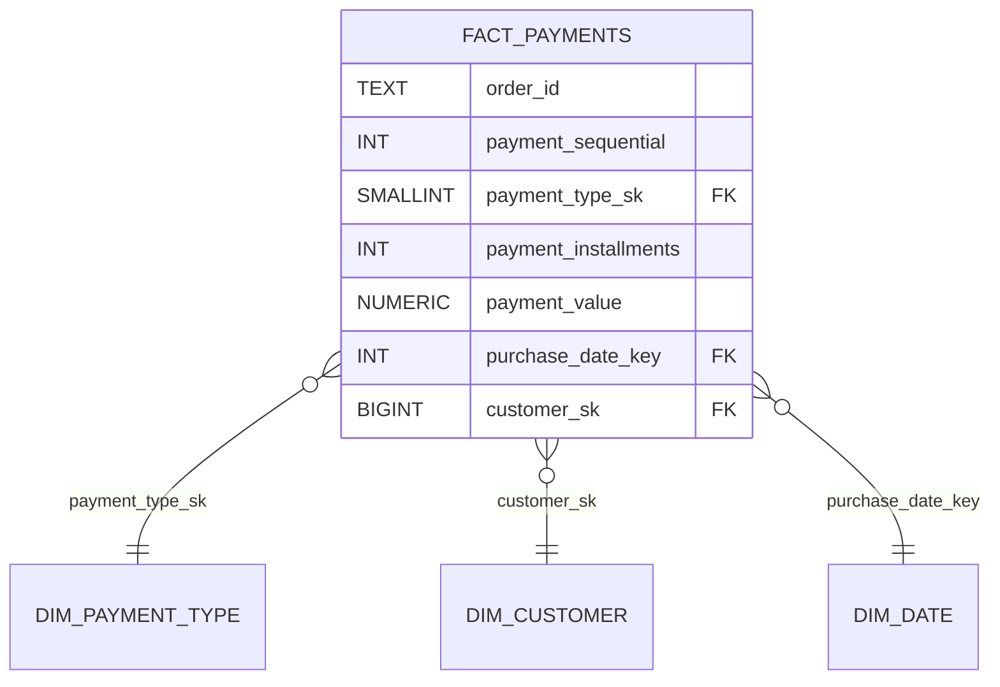
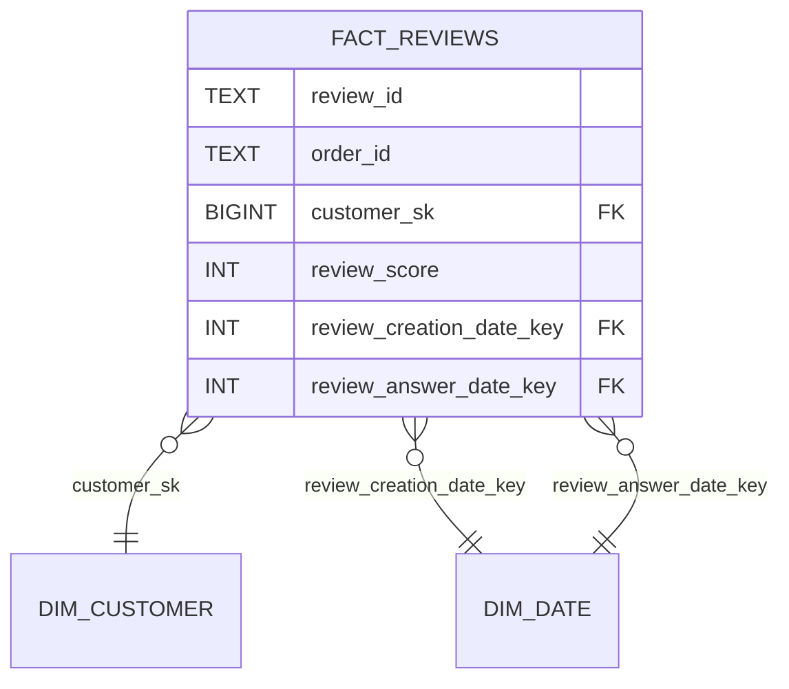
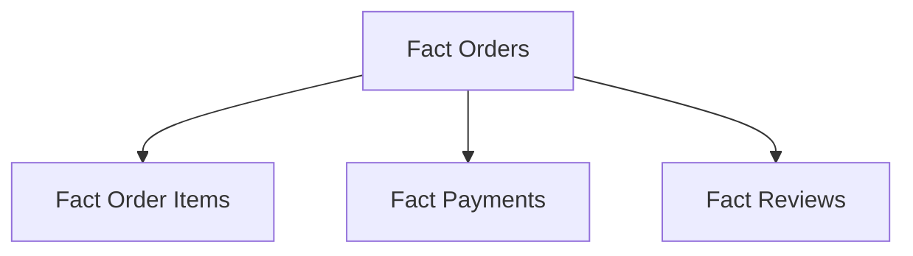

```mermaid
flowchart LR
    CSV[CSV Files] --> STG[staging schema]
    STG --> DIM[dw.dim_*]
    STG --> FACT[dw.fact_*]
    DIM --> FACT
```

```mermaid
erDiagram
    STG_CUSTOMERS {
        TEXT customer_id
        TEXT customer_unique_id
        TEXT customer_zip_code_prefix
        TEXT customer_city
        TEXT customer_state
    }

    STG_SELLERS {
        TEXT seller_id
        TEXT seller_zip_code_prefix
        TEXT seller_city
        TEXT seller_state
    }

    STG_PRODUCTS {
        TEXT product_id
        TEXT product_category_name
        TEXT product_weight_g
    }

    STG_ORDERS {
        TEXT order_id
        TEXT customer_id
        TEXT order_status
        TEXT order_purchase_timestamp
        TEXT order_delivered_customer_date
    }

    STG_ORDER_ITEMS {
        TEXT order_id
        TEXT order_item_id
        TEXT product_id
        TEXT seller_id
        TEXT shipping_limit_date
        TEXT price
        TEXT freight_value
    }

    STG_ORDER_PAYMENTS {
        TEXT order_id
        TEXT payment_sequential
        TEXT payment_type
        TEXT payment_value
    }

    STG_ORDER_REVIEWS {
        TEXT review_id
        TEXT order_id
        TEXT review_score
        TEXT review_creation_date
        TEXT review_answer_timestamp
    }
```

```mermaid
erDiagram
    DIM_DATE {
        INT date_key PK
        DATE date
        INT year
        INT quarter
        INT month
        TEXT month_name
        INT day
        INT day_of_week
        BOOLEAN is_weekend
    }

    DIM_CUSTOMER {
        BIGINT customer_sk PK
        TEXT customer_id
        TEXT customer_unique_id
        TEXT zip_code_prefix
        TEXT city
        TEXT state
    }

    DIM_SELLER {
        BIGINT seller_sk PK
        TEXT seller_id
        TEXT zip_code_prefix
        TEXT city
        TEXT state
    }

    DIM_PRODUCT {
        BIGINT product_sk PK
        TEXT product_id
        TEXT category_name
        TEXT category_name_english
        INT weight_g
    }

    DIM_ORDER_STATUS {
        SMALLINT order_status_sk PK
        TEXT order_status
    }

    DIM_PAYMENT_TYPE {
        SMALLINT payment_type_sk PK
        TEXT payment_type
    }
```

```mermaid
erDiagram
    FACT_ORDER_ITEMS {
        BIGINT order_item_sk PK
        TEXT order_id
        INT order_item_id
        BIGINT customer_sk FK
        BIGINT seller_sk FK
        BIGINT product_sk FK
        SMALLINT order_status_sk FK
        INT purchase_date_key FK
        INT shipping_limit_date_key FK
        INT delivered_customer_date_key FK
        INT estimated_delivery_date_key FK
        NUMERIC price
        NUMERIC freight_value
    }

    FACT_ORDER_ITEMS }o--|| DIM_CUSTOMER : customer_sk
    FACT_ORDER_ITEMS }o--|| DIM_SELLER : seller_sk
    FACT_ORDER_ITEMS }o--|| DIM_PRODUCT : product_sk
    FACT_ORDER_ITEMS }o--|| DIM_ORDER_STATUS : order_status_sk
    FACT_ORDER_ITEMS }o--|| DIM_DATE : purchase_date_key

```

```mermaid
erDiagram
    FACT_ORDERS {
        TEXT order_id PK
        BIGINT customer_sk FK
        SMALLINT order_status_sk FK
        INT purchase_date_key FK
        INT approved_date_key FK
        INT delivered_carrier_date_key FK
        INT delivered_customer_date_key FK
        INT estimated_delivery_date_key FK
        INT items_count
        NUMERIC order_item_total
        NUMERIC freight_total
        NUMERIC payment_total
    }

    FACT_ORDERS }o--|| DIM_CUSTOMER : customer_sk
    FACT_ORDERS }o--|| DIM_ORDER_STATUS : order_status_sk
    FACT_ORDERS }o--|| DIM_DATE : purchase_date_key

```

```mermaid
erDiagram
    FACT_PAYMENTS {
        TEXT order_id
        INT payment_sequential
        SMALLINT payment_type_sk FK
        INT payment_installments
        NUMERIC payment_value
        INT purchase_date_key FK
        BIGINT customer_sk FK
    }

    FACT_PAYMENTS }o--|| DIM_PAYMENT_TYPE : payment_type_sk
    FACT_PAYMENTS }o--|| DIM_CUSTOMER : customer_sk
    FACT_PAYMENTS }o--|| DIM_DATE : purchase_date_key

```

```mermaid
erDiagram
    FACT_REVIEWS {
        TEXT review_id
        TEXT order_id
        BIGINT customer_sk FK
        INT review_score
        INT review_creation_date_key FK
        INT review_answer_date_key FK
    }

    FACT_REVIEWS }o--|| DIM_CUSTOMER : customer_sk
    FACT_REVIEWS }o--|| DIM_DATE : review_creation_date_key
    FACT_REVIEWS }o--|| DIM_DATE : review_answer_date_key

```

```mermaid
flowchart TB
    ORDERS[Fact Orders]
    ITEMS[Fact Order Items]
    PAYMENTS[Fact Payments]
    REVIEWS[Fact Reviews]

    ORDERS --> ITEMS
    ORDERS --> PAYMENTS
    ORDERS --> REVIEWS
```